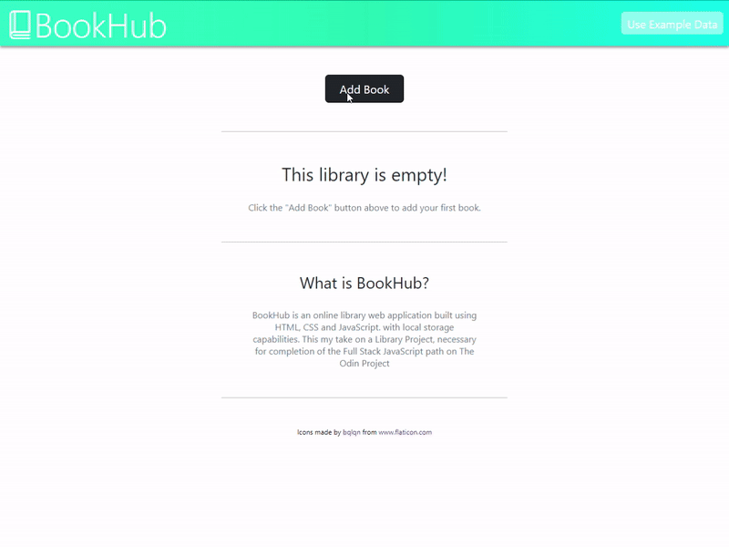

# BookHub - Online Library Application

## What is BookHub?
`BookHub` is an online library web application built using HTML, CSS and JavaScript. with local storage capabilities. This my take on a Library Project, necessary for completion of the Full Stack JavaScript  <a href="https://www.theodinproject.com/paths/full-stack-javascript" target="_blank">path</a> on **The Odin Project**.

## Installation
 BookHub is available live on GitHub [pages](https://github.com/bardenHa/Library/tree/main).
 
 To run the application locally, follow these steps:
 

 1. Either clone the repository with `git clone https://github.com/bardenHa/Library`, or download the `.zip` and extract it.
 2. Run the application on a local host or open the `index.html` using a browser.
## Usage
Add your chosen book using the `Add Book` button and filling out the parameters shown in the modal.  Upon clicking save, the book will be saved to the library. The read status on a book can be changed at any point by clicking the `Read` button on the book's card. Similarly, a book can be deleted using the `delete` button. The `Use example data` button can also be used to add sample data for easier testing.

Whenever updates are made to the library, data is saved using the `localStorage` mechanism from [Web Storage API](https://developer.mozilla.org/en-US/docs/Web/API/Web_Storage_API). This allows the user's data to be saved on the local machine for convenience should they use the application at a later date.

## Contributing 
When experiencing any problems using the application, please submit an issue. Pull requests are also welcome should the user wish to implement any changes to the application.
## License
This project uses the [MIT License](Library/LICENSE).
